# Hola AI

## Arbeiten mit KI-Unterstützung

Session 1 | 05.12.2025

---

# Wer bin ich?

<div class="mt-16">

**Oladayo Fagbemi**

Premium Sales Services

oladayo.fagbemi@axelspringer.com

</div>

---

# Der Fahrplan

3 Sessions, je 90 Minuten

| Session | Datum | Thema |
|---------|-------|-------|
| **1** | 05.12. | Grundlagen & erste Schritte |
| 2 | 12.12. | Workflow-Integration |
| 3 | 19.12. | Advanced (MCP, Security) |

---

# Ziel heute

<v-clicks>

- **Überblick:** Wie kann KI bei der Arbeit helfen?
- **Setup:** Claude Code läuft bei euch
- **Kontext:** Bessere Ergebnisse durch gute Instruktionen
- **Praxis:** Erste Schritte gemeinsam

</v-clicks>

---

# Eure Antworten

```mermaid
pie showData
    title 17 Teilnehmer
    "Mittelstufe" : 6
    "Unsicher" : 5
    "Fortg. Anfänger" : 4
    "Anfänger" : 2
```

<div class="flex justify-center scale-130 mt-8">



</div>

<div class="text-center mt-16 text-xl">

**~65% sind Einsteiger** - Wir starten bei den Grundlagen.

</div>

---
layout: section
---

# Teil 1
## KI-Tools im Überblick

---

# Zwei Wege, KI zu nutzen

<div class="grid grid-cols-2 gap-8 mt-8">

<div class="p-6 bg-[#1a1a1a] rounded">

### Fragen & Antworten

- Du fragst, KI antwortet
- Copy-paste Workflow
- *"Wie mache ich X?"*
- **Du** machst die Arbeit

</div>

<div class="p-6 bg-[#1f3a1f] rounded">

### Agentic

- Führt Aufgaben selbständig aus
- Arbeitet direkt in deinem Projekt
- *"Mach X für mich"*
- **KI** arbeitet, du prüfst

</div>

</div>

---

# Welches Tool wofür?

| Aufgabe | Tool-Beispiele |
|---------|----------------|
| Allgemein | ChatGPT, Claude.ai |
| Code schreiben | Copilot, Cursor |
| Ganze Features umsetzen | **Claude Code** |
| Recherche mit Quellen | Perplexity |
| Bilder erstellen | Midjourney, DALL-E |

<div class="mt-8 text-center">

Mehr Details: [hola-ai.dev/blog/ki-tools-uebersicht](https://hola-ai.dev/blog/ki-tools-uebersicht)

</div>

---

# Was ist Agentic AI?

<div class="flex items-center justify-center gap-6 mt-12 text-2xl">
  <div class="p-6 bg-[#1a1a1a] rounded text-center">
    <div class="text-4xl mb-2">🧠</div>
    <div class="font-semibold">LLM</div>
    <div class="text-sm opacity-70">Denken, Planen</div>
  </div>
  <div class="text-4xl">+</div>
  <div class="p-6 bg-[#1a1a1a] rounded text-center">
    <div class="text-4xl mb-2">🔧</div>
    <div class="font-semibold">Tools</div>
    <div class="text-sm opacity-70">git, npm, Dateien...</div>
  </div>
  <div class="text-4xl">=</div>
  <div class="p-6 bg-[#1f3a1f] rounded text-center">
    <div class="text-4xl mb-2">🤖</div>
    <div class="font-semibold">Agentic AI</div>
    <div class="text-sm opacity-70">Handeln</div>
  </div>
</div>

---

# Warum Agentic AI?

Die goldene Mitte zwischen Kontrolle und Autonomie:

<v-clicks>

- **Volle Kontrolle** - Du siehst jeden Schritt
- **Direkter Dateizugriff** - Kein Copy-Paste
- **Du entscheidest** - Jede Aktion braucht dein OK
- **Nutzt deine Tools** - git, npm, make, curl... alles verfügbar
- **Im Terminal zuhause** - Passt in jeden Workflow

</v-clicks>

---

# Die Top LLMs

Diese Modelle treiben Agentic AI an:

<div class="grid grid-cols-2 gap-6 mt-6 text-sm">

<div>

### Proprietär

| Anbieter | Flagship |
|----------|----------|
| **OpenAI** | GPT-5.1 Codex |
| **Google** | Gemini 2.5 Pro |
| **Anthropic** | Claude Opus 4.5 |

</div>

<div>

### Open Source

| Modell | Von |
|--------|-----|
| **Llama 3.2** | Meta |
| **DeepSeek V3** | DeepSeek |
| **Mixtral** | Mistral AI |
| **Qwen 2.5** | Alibaba |

</div>

</div>

<div class="mt-6 text-center text-base opacity-80">

Wir nutzen **Claude Sonnet 4.5** via NMT AI Gateway.

</div>

---

# Claude Code

Anthropic's Agentic Coding Tool - läuft direkt im Terminal.

<div class="grid grid-cols-2 gap-8 mt-6">

<div>

**So funktioniert's:**

1. `claude` im Terminal starten
2. Beschreiben, was du willst
3. Claude liest Dateien, versteht Kontext
4. Schlägt Änderungen vor
5. Du sagst Ja oder Nein

</div>

<div>
  
</div>

</div>

---
layout: section
---

# Setup Checkpoint
⏱️ 10 Minuten

[hola-ai.dev/guides/setup](https://hola-ai.dev/guides/setup)

---
layout: center
---

# Kurzer Check

<CloudPoll
  pollId="session1-setup-v2"
  question="Wer hat das Setup geschafft?"
  :options="['Ja, läuft!', 'Teilweise', 'Nein / Probleme']"
/>

---

# Was kann Claude Code?

<div class="grid grid-cols-2 gap-6 mt-8">

<v-clicks>

<div class="p-4 bg-[#1a1a1a] rounded">

**Code analysieren**

Projekt verstehen, Patterns erkennen

</div>

<div class="p-4 bg-[#1a1a1a] rounded">

**Debugging**

Fehler finden und beheben

</div>

<div class="p-4 bg-[#1a1a1a] rounded">

**Features bauen**

Neue Funktionen implementieren

</div>

<div class="p-4 bg-[#1a1a1a] rounded">

**Dateien erstellen**

Markdown, Tests, Configs...

</div>

<div class="p-4 bg-[#1a1a1a] rounded">

**Refactoring**

Code verbessern, aufräumen

</div>

<div class="p-4 bg-[#1a1a1a] rounded">

**Git & Terminal**

Commits, Branches, Shell-Befehle

</div>

</v-clicks>

</div>

---
layout: section
---

# Teil 2
## Kontext ist King

---

# Kontext = Anpassung

<div class="grid grid-cols-2 gap-8 mt-8">

<div class="p-6 bg-[#1a1a1a] rounded">

### Ohne Kontext

- Generische Antworten
- Rät welches Framework
- Standard-Patterns
- "One size fits all"

<div class="mt-4 text-red-400 font-semibold">→ Mehr Nacharbeit</div>

</div>

<v-click>

<div class="p-6 bg-[#1f3a1f] rounded">

### Mit Kontext

- Passt zu **deinem** Stack
- Kennt eure Conventions
- Nutzt installierte Libs
- Spricht eure Sprache

<div class="mt-4 text-green-400 font-semibold">→ Sofort nutzbar</div>

</div>

</v-click>

</div>

<v-click>

<div class="text-center mt-8 text-xl">

**Kontext formt das Verhalten - du bekommst, was du brauchst.**

</div>

</v-click>

---

# CLAUDE.md

Eine Datei im Projekt-Root - echtes Beispiel:

```markdown
# Claude Configuration

**These rules apply to all sessions.**

## Rule #1: Conciseness
Extreme brevity. Sacrifice grammar. No filler.

## Rule #2: No Emojis
Don't use emojis in code or coding projects.

## Rule #3: JS/TS Spacing
Empty line before: if, return, throw

## User Context
- Oladayo Fagbemi | Fullstack Developer
- Tools: Makefile, pnpm, ast-grep
```

---

# Cascading Context

Claude liest **alle** CLAUDE.md-Dateien in der Verzeichnishierarchie:

<div class="mt-8 flex justify-center">
<div class="font-mono text-left text-sm leading-relaxed">

<div class="flex items-center gap-2">
  <span class="opacity-50">~</span>
</div>
<div class="flex items-center gap-2 ml-4">
  <span class="opacity-50">├──</span>
  <span class="text-blue-400 font-semibold">CLAUDE.md</span>
  <span class="opacity-50 ml-2">← Dein Stil</span>
</div>
<div class="flex items-center gap-2 ml-4">
  <span class="opacity-50">└── code/</span>
</div>
<div class="flex items-center gap-2 ml-12">
  <span class="opacity-50">├──</span>
  <span class="text-blue-400 font-semibold">CLAUDE.md</span>
  <span class="opacity-50 ml-2">← Team-Standards</span>
</div>
<div class="flex items-center gap-2 ml-12">
  <span class="opacity-50">└── project/</span>
</div>
<div class="flex items-center gap-2 ml-20">
  <span class="opacity-50">└──</span>
  <span class="text-green-400 font-semibold">CLAUDE.md</span>
  <span class="opacity-50 ml-2">← Stack & Patterns</span>
</div>

</div>
</div>

<v-click>

<div class="text-center mt-8 p-4 bg-[#1a1a1a] rounded">

Alle werden gelesen und kombiniert - alles wird Kontext.

</div>

<div class="text-center mt-4 font-mono text-sm">

Tipp: <code>/init</code> lässt Claude dein Projekt analysieren und eine CLAUDE.md generieren.

</div>

</v-click>

---

# Was gehört rein?

<div class="grid grid-cols-2 gap-8 mt-4">

<div>

### Unbedingt

- Tech Stack
- Wichtige Konventionen
- Error-Handling Patterns
- Projekt-Struktur

</div>

<div>

### Optional

- Team-Präferenzen
- Deployment-Info
- Links zu Docs
- Beispiel-Commands

</div>

</div>

---
layout: section
---

# Live Demo

---
layout: section
---

# Teil 3
## Tips & Pitfalls

---

# Gute Prompts

<v-clicks>

1. **Spezifisch sein** - "Funktion X in Datei Y ändern"
2. **Kontext geben** - Je mehr, desto besser
3. **Kleine Schritte** - Nicht alles auf einmal
4. **Verifizieren** - KI macht Fehler

</v-clicks>

---

# Häufige Fehler

<v-clicks>

- ❌ Zu vage: *"Mach das besser"*
- ❌ Zu viel: *"Refaktoriere alles"*
- ❌ Blind vertrauen: Output nicht prüfen
- ❌ Kein Kontext: CLAUDE.md vergessen

</v-clicks>

---

# Der wichtigste Tipp

<div class="text-center mt-16">

<div class="text-4xl mb-8">

🔍

</div>

<div class="text-3xl font-semibold">

Immer den Output prüfen.

</div>

<div class="text-xl mt-4 opacity-70">

KI ist ein Werkzeug, kein Ersatz für Verständnis.

</div>

</div>

---
layout: section
---

# Ausblick

---

# Nächste Sessions

<div class="grid grid-cols-1 gap-8 mt-8">

<div class="p-6 bg-[#1a1a1a] rounded">

**Session 2 (12.12.)** - Workflow-Integration

- CLAUDE.md Deep-Dive
- Agentic Workflows im Alltag
- Komplexere Aufgaben

</div>

<div class="p-6 bg-[#1a1a1a] rounded">

**Session 3 (19.12.)** - Advanced

- Code Reviews mit KI
- Security Best Practices
- MCP Server (für Power-User)

</div>

</div>

---

# Ressourcen

<div class="grid grid-cols-1 gap-4 mt-8">

- **Setup-Guide:** [hola-ai.dev/guides/setup](https://hola-ai.dev/guides/setup)
- **Tools-Übersicht:** [hola-ai.dev/blog/ki-tools-uebersicht](https://hola-ai.dev/blog/ki-tools-uebersicht)
- **Claude Docs:** [docs.anthropic.com](https://docs.anthropic.com/en/docs/claude-code)

</div>

<div class="mt-8 p-4 bg-[#1a1a1a] rounded">

**Fragen?** oladayo.fagbemi@axelspringer.com

</div>

---
layout: center
---

# Fragen?

*Offene Runde*

---
layout: center
class: text-center
---

# Danke!

Bis zum 12.12.

*hola-ai.dev*
